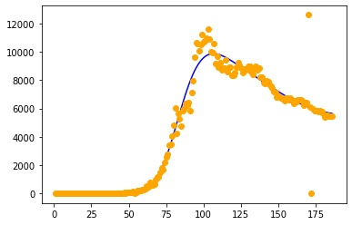

# Regression - Analisys of coronavirus

- The data from 3.08.2020
- The chart of coronavirus

- Predicted values for Russia:
  - *4.08* - **5624** cases
  - *5.08* - **5607** cases
  - *6.08* - **5591** cases
  - *7.08* - **5576** cases
  - *8.08* - **5561** cases
  - *9.08* - **5547** cases
  - *10.08* - **5534** cases
- The important thing to notice is that the statistic has a big inaccuracy (error), because the neural network has analized all data from February (the start of official cases in Russia) and find the common rule. The *real* cases will be lower, but the regression should show the trend
